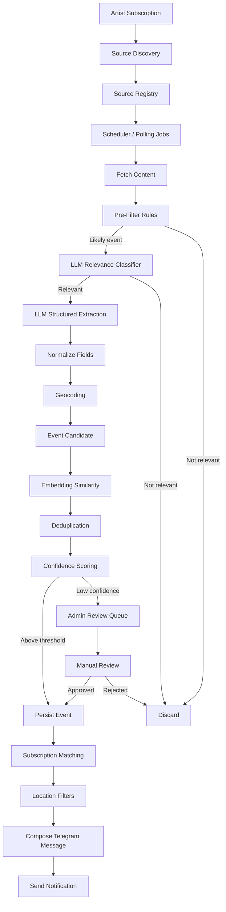

# Concert Tracker Requirements and Implementation Steps

## Goals
- Track upcoming live shows, concerts, tours, and festival appearances per artist.
- Detect announcements from official sources first, then broader discovery sources.
- Deliver concise Telegram notifications with date, location, venue, and ticket link.
- Support user subscriptions with continent, country, and city-based filtering.
- Keep the MVP small but design the system to scale to many artists and users.
- Maintain a clean, modular architecture suitable for open-source use later.

## Scope Assumptions
- MVP targets a small, curated set of artists with manual onboarding.
- Initial data sources focus on official APIs and artist-owned websites.
- Social networks are used only via official APIs or approved aggregators.
- Public-page scraping is limited, rate-limited, and must respect site terms.
- Short term: artists and sources are predefined and curated.
- Long term: users can subscribe to any artist and the system discovers sources.
- No ticket purchasing or payments in the initial scope.
- English-first extraction with a path to multilingual support later.
- Location filtering supports continents, countries, and cities from day one.
- Notification delivery is near-real-time but not guaranteed to be instant.

## Functional Requirements
- Artist management: create, update, deactivate, and merge artist identities.
- Source registry: link per-artist sources and global discovery sources.
- Ingestion scheduler: periodic polling with per-source rate limits and retries.
- Source metadata storage: keep URL, timestamp, and extracted fields only.
- Event extraction: parse dates, venues, cities, countries, ticket links, and price range.
- Event normalization: standardize venue names and location fields.
- Deduplication: merge events from multiple sources with confidence scoring.
- Location filters: continent, country, city, and radius-based matching.
- User subscriptions: per-artist and per-location preferences.
- Telegram bot: subscriptions, alerts, search, and quick feedback actions.
- Admin review: queue low-confidence events for manual confirmation.

## Non-Functional Requirements
- Reliability: ingestion must recover from transient failures and avoid data loss.
- Cost control: minimize LLM calls with pre-filtering, caching, and batching.
- Latency: notifications should be delivered within a defined SLA window.
- Scalability: handle growth in artists, sources, and users without rewrites.
- Maintainability: modular services with clear interfaces and test coverage.
- Observability: logs, metrics, and alerting for pipeline health and errors.
- Security: protect API keys, user data, and bot tokens.
- Compliance: respect platform terms, privacy requirements, and opt-outs.

## AI Requirements
- Relevance classification to detect event-related content with low false positives.
- Structured extraction with strict JSON schema and validation rules.
- Grounded output only: no inferred dates/venues without evidence in text.
- Confidence scoring per field (date, venue, city, ticket link, price range).
- Embeddings for similarity search and deduplication across sources.
- Optional reranking to improve precision for near-duplicate events.
- Language handling: English-first, multilingual support planned.
- Model fallback: retry with alternate model on extraction failure.
- Evaluation: maintain a small test set of announcements for regression checks.
- Prompt versioning to track changes and performance over time.

## Pipeline Diagram

## Data Sources
- Event APIs (primary): Songkick, Bandsintown, Ticketmaster Discovery, Eventbrite.
- Regional event sources (optional): Resident Advisor, See Tickets, Dice (if available).
- Official artist sites: tour pages, news pages, and press releases.
- Calendars/feeds: RSS and ICS feeds when published by artists or venues.
- Social platforms (official APIs only): Facebook Pages, Instagram Graph, YouTube Data, X API.
- Web discovery: Google Custom Search or Bing Web Search for new sources.
- Metadata/identity: MusicBrainz and Wikidata for artist identity matching.
- Aggregators: RSSHub or similar only when terms allow.
- MVP target: 1-2 event APIs + official artist sites before adding socials.
- Source priority: official API/website > reputable event API > social > web discovery.
- Connector requirements: auth handling, pagination, rate limits, and retries.
- Update cadence: API sources hourly, websites daily, socials every few hours.
- Trust tiers: assign confidence based on source type and history.

## Location Filtering
- Normalize location names via geocoding to city/country/continent.
- Store both raw location text and normalized fields.
- Apply filtering during notification and optionally during ingestion.

## Telegram Bot Requirements
- Subscribe/unsubscribe to artists and locations.
- Notify on new confirmed events with link, location, and price range.
- Allow per-user notification preferences and quiet hours.

## Approximate Implementation Steps
1. Project setup: NestJS workspace, config module, linting, and CI basics.
2. Domain model and DB schema: artists, sources, events, venues, users, subscriptions, and source metadata.
3. Core services: artist registry, source registry, event service, and subscription service.
4. Ingestion framework: scheduler, queue, retries, rate limiting, and connector interface.
5. Initial connectors: 1-2 event APIs and official artist sites.
6. AI pipeline: relevance filter, structured extraction, validation, and confidence scoring.
7. Normalization: geocoding, venue standardization, and location mapping.
8. Deduplication: embeddings + rule-based merging and source trust tiers.
9. Notification engine: subscription matching, location filters, and message formatting.
10. Telegram bot: onboarding, subscriptions, preferences, and feedback actions.
11. Admin workflow: review queue for low-confidence events and overrides.
12. Observability and tests: logs, metrics, basic dashboards, and regression set.
13. Deployment: secret management, worker scaling, and scheduled job hosting.
